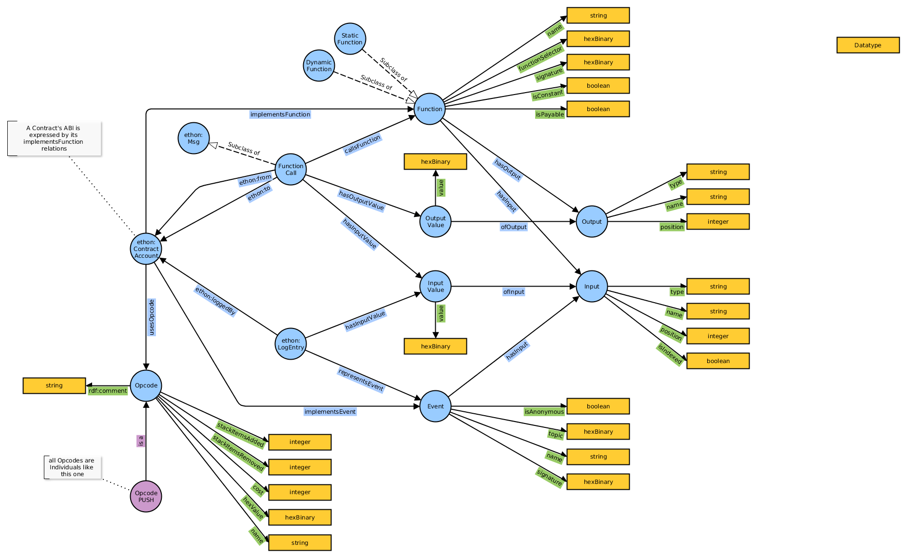

# Contracts extension to EthOn
This ontology extends EthOn with concepts that can be used to describe smart contracts in [ContractAccounts](http://ethon.consensys.net/ContractAccount).

Ressources:
- [Specification](http://ethon.consensys.net/Contracts/EthOn_Contracts_spec.html)
- [Glossary](https://github.com/ConsenSys/EthOn/tree/master/Contracts/EthOn_Contracts_glossary.md)

This is an Overview of how the EthOn Contracts extension models a smart contract.

[Visualize using WebVOWL](http://visualdataweb.de/webvowl/#iri=https://raw.githubusercontent.com/ConsenSys/EthOn/master/Contracts/EthOn_Contracts.rdf)