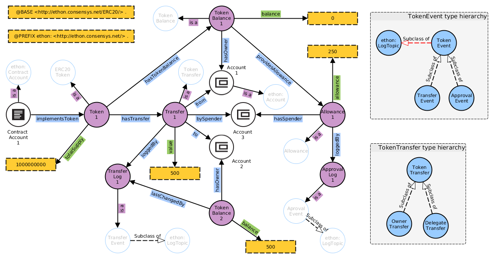

# ERC-20 extension to EthOn
This ontology extends EthOn with concepts that can be used to describe ERC20 compliant Tokens.

Ressources:
- [Specification](http://ethon.consensys.net/ERC20/EthOn_ERC20_spec.html)
- [Glossary](https://github.com/ConsenSys/EthOn/tree/master/ERC20/EthOn_ERC20_glossary.md)

This is an Overview of how the EthOn ERC-20 extension models a Token.

[Visualize using WebVOWL](http://visualdataweb.de/webvowl/#iri=https://raw.githubusercontent.com/ConsenSys/EthOn/master/ERC20/EthOn_ERC20.rdf)