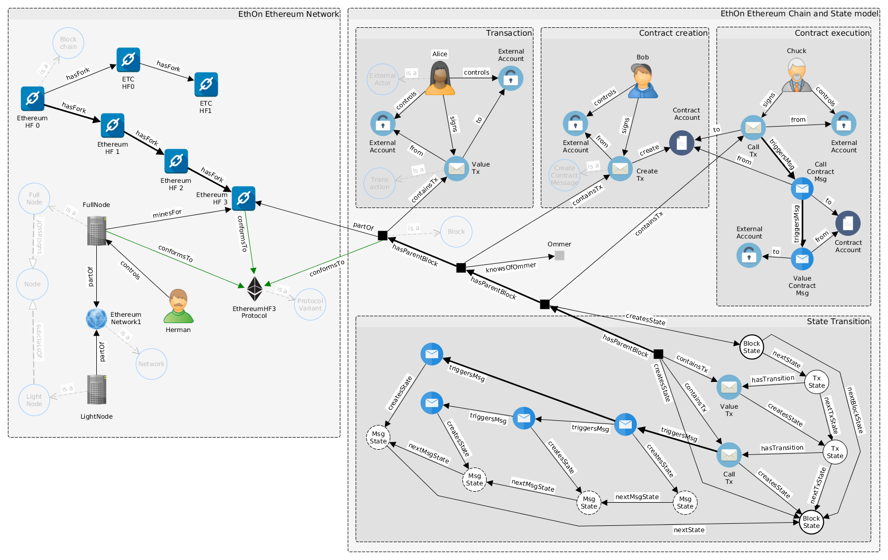
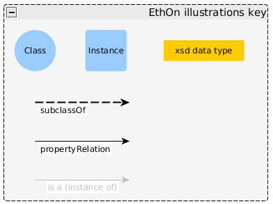
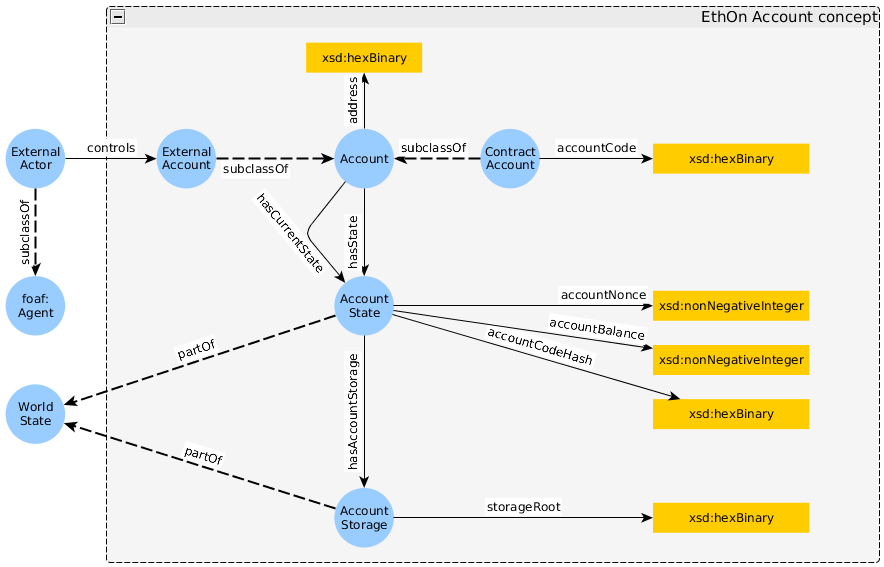
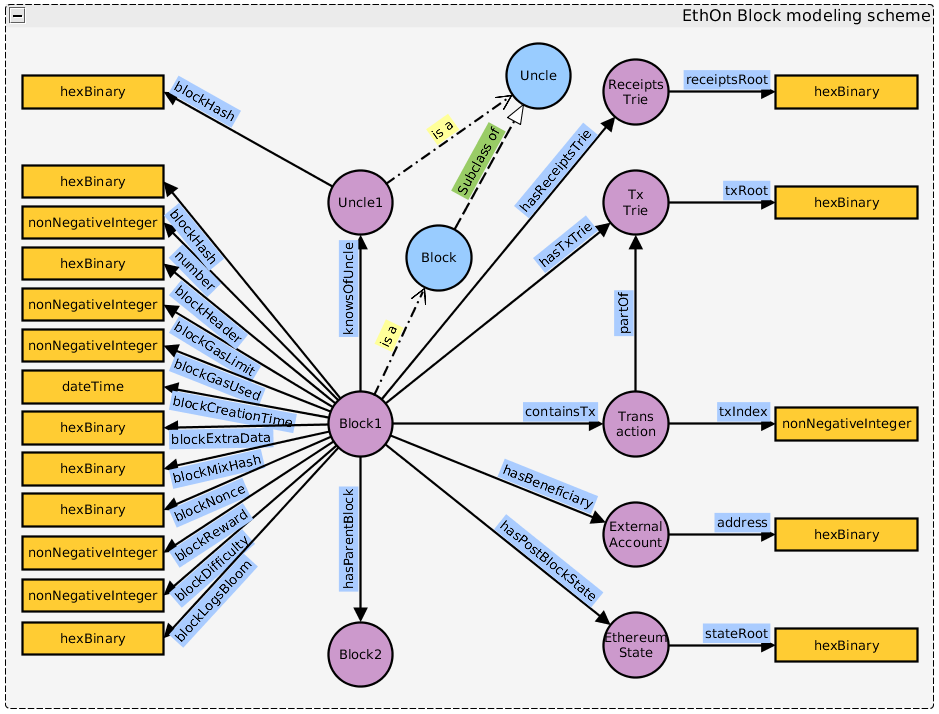
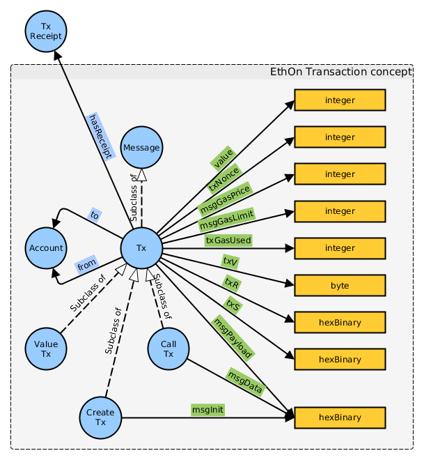
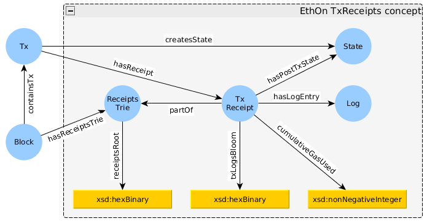
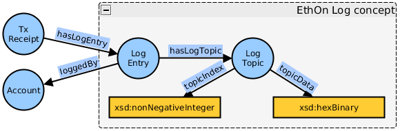
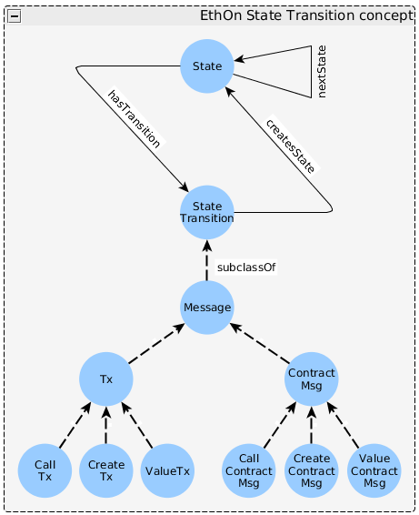
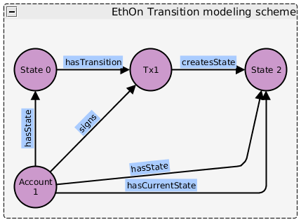
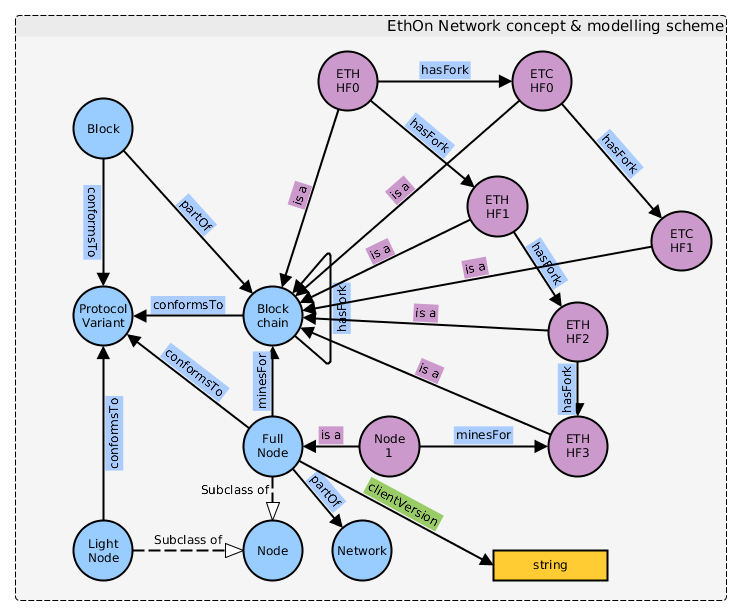

#### Simplified EthOn model of Ethereum

#### Illustration key

#### Account concept

#### Block modeling scheme

#### Message, Transaction Receipt and Log concepts

#### State Transition concept and modeling scheme

#### Network concept and modeling scheme
